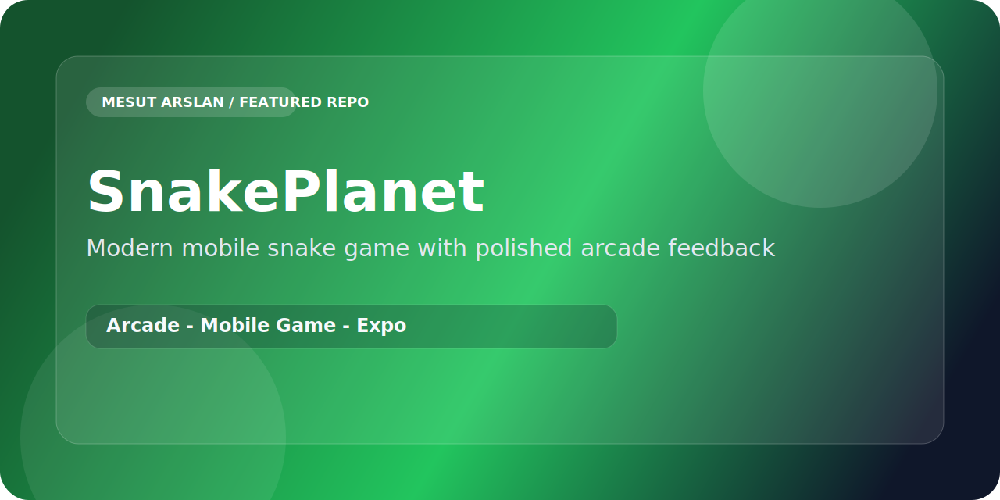

<p align="center">
  
</p>

<p align="center">
  
  
  
</p>

# SnakePlanet

`SnakePlanet` reimagines the classic snake formula as a sharper mobile arcade product with better feedback, cleaner presentation, and replay-focused pacing.

## What Makes It Stronger Than a Basic Clone

- Pushes the project beyond a simple tutorial-style snake game
- Focuses on feel, responsiveness, and repeatable sessions
- Works as a compact casual game with stronger identity
- Presents arcade mechanics with a more polished mobile layer

## Stack

- React Native
- Expo
- JavaScript

## Product Direction

The project aims to keep the classic loop familiar while making the overall experience feel more deliberate, modern, and replay-friendly on mobile.

## Run Locally

```bash
npm install
npx expo start
```
